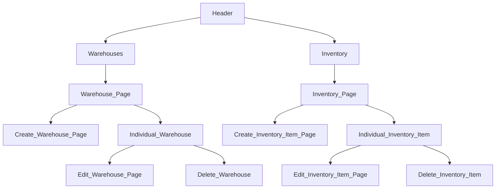

# InStock - Inventory Management System

InStock is a modern and scalable inventory management system, built with a React front-end and an Express back-end.

# Table of Contents
1. [Getting Started](#start)
2. [Site Map](#map)
3. [Outline](#outline)
4. [Future Improvements](#future)

# Developer Guide
## Getting Started 
You will need node installed on your system.
Clone the repo and open it.
Set up your .env using the .env.sample

### On front end run:
`npm install`
`npm start`

### On back end,
Make sure your mysql is setup,
then
run:
`npm run db:migrate`
`npm run db:seed`

`npm run dev`
If above doesnt work try:
`node index.js`

## Site Map 

## Outline 
The project is to build an Inventory Management System for a Fortune 500 client.
The system will be built by a team of developers using React, Node, Express, and mysql. The team will follow Agile methodology and use JIRA to manage the workflow.
A design tool called Figma will be used to create the mockups and style guide.
The team will also use Git/GitHub to collaborate and manage version control.
The project must adhere to functional and visual design requirements as specified in JIRA tickets.
The site must use multiple routes and proper folder structure and naming conventions for a full stack web application.
Third-party libraries can be used.

## Future Improvements 
In the future, we plan to expand the capabilities of the InStock Inventory Management System by incorporating the following features:

### Basic CRM (Customer Relationship Management)
A CRM integration will allow our users to manage their customer data, track interactions, and facilitate better communication between the inventory management team and their clients. This feature will include:
- Customer profiles with contact information and activity history
- Task management and reminders for follow-ups
- Integration with email and other communication channels
- Customizable reporting and analytics

### Price History
Tracking price history is essential for businesses to understand market trends and make informed decisions on pricing strategies. The price history feature will provide:
- Historical data on product pricing
- Visualizations of price trends over time
- Alerts for significant price changes
- Integration with inventory data for better analysis

### System Administration
System administration features will be added to ensure smooth operation and management of the Inventory Management System. This will include:
- User management: Add, modify, and delete users with different access levels and permissions
- Audit logs: Track user activity and system changes for security and compliance purposes
- Data backup and recovery: Schedule automatic backups and restore functionality in case of data loss
- System performance monitoring: Tools to monitor and optimize system performance for a seamless user experience

These additional features will further enhance the capabilities of the InStock Inventory Management System, making it an even more comprehensive and powerful tool for businesses to manage their inventory efficiently